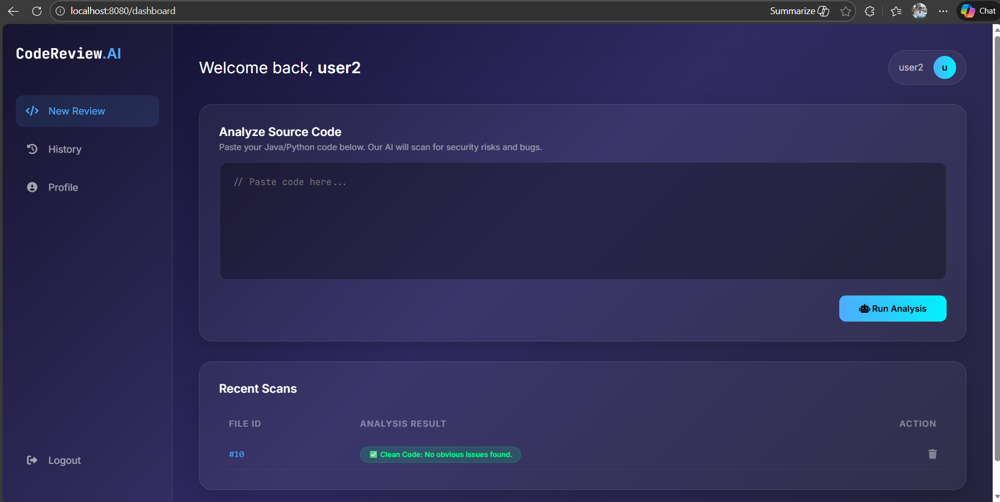
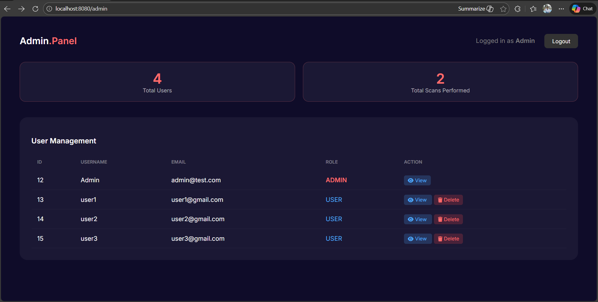
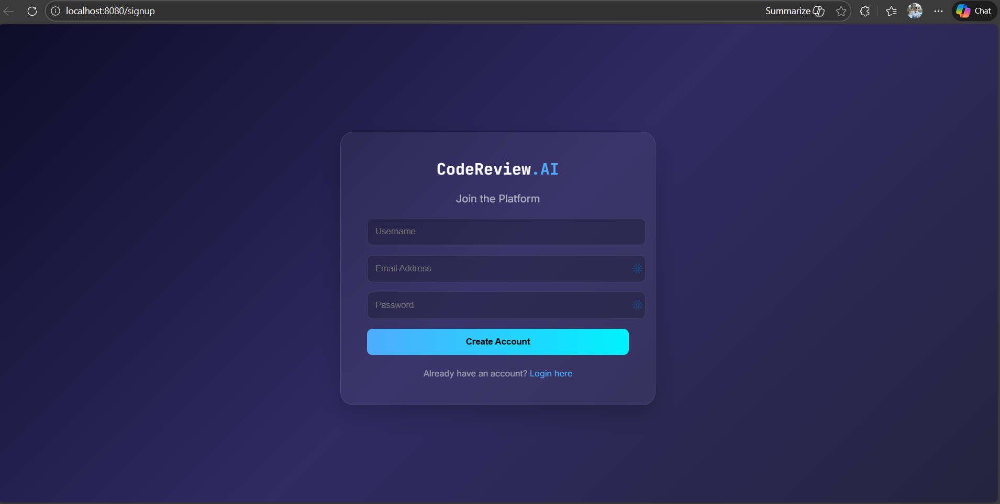
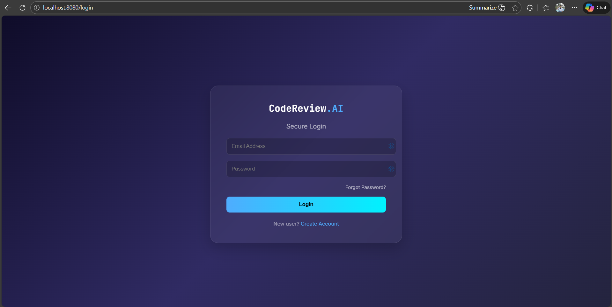

# 🛡️ ML-Powered Code Review Platform

> A secure, full-stack Spring Boot application that automates code analysis to detect bugs, security vulnerabilities, and "dirty code" patterns in Java.


## 📖 Overview
This platform allows developers to submit source code for automated review. It uses a **Rule-Based Analysis Engine** (upgradable to ML) to flag issues like:
- 🚫 **Security Risks:** Hardcoded passwords, SQL injection vulnerabilities.
- 🐛 **Bugs:** Empty catch blocks, resource leaks.
- 🧹 **Clean Code:** Usage of `System.out.println` instead of Loggers.

It features a complete **Role-Based Access Control (RBAC)** system, separating standard Users from Admins.

## ✨ Key Features
### 🔐 Security Module
- **BCrypt Hashing:** Passwords are never stored in plain text.
- **Session Management:** Secure login sessions with `HttpSession`.
- **RBAC:** Middleware to protect Admin routes (`/admin`) from unauthorized access.

### 👤 User Dashboard
- **Instant Analysis:** Real-time feedback on uploaded code.
- **History Tracking:** View past scans and delete old records.
- **Glassmorphism UI:** A modern, responsive interface.

### 🛠 Admin Panel
- **User Management:** View all registered users and delete accounts.
- **Submission Inspection:** Admins can "peek" into any user's code history to audit their work.
- **System Stats:** Visual counters for total users and total scans.

## 🏗️ Technical Architecture
- **Backend:** Java, Spring Boot (Web, Data JPA, Security)
- **Frontend:** HTML5, Thymeleaf, CSS3 (Glassmorphism Effect)
- **Database:** MySQL (Relational Data Model)
- **Tools:** Maven, Git, Eclipse STS

## 📸 Screenshots
| User Dashboard | Admin Panel |
| :---: | :---: |
|  |  |  |  |


## 🚀 How to Run Locally
1. **Clone the Repo:**
   ```bash
   git clone [https://github.com/KushalShah2512/ML-Powered-Code-Review-Platform](https://github.com/KushalShah2512/ML-Powered-Code-Review-Platform)