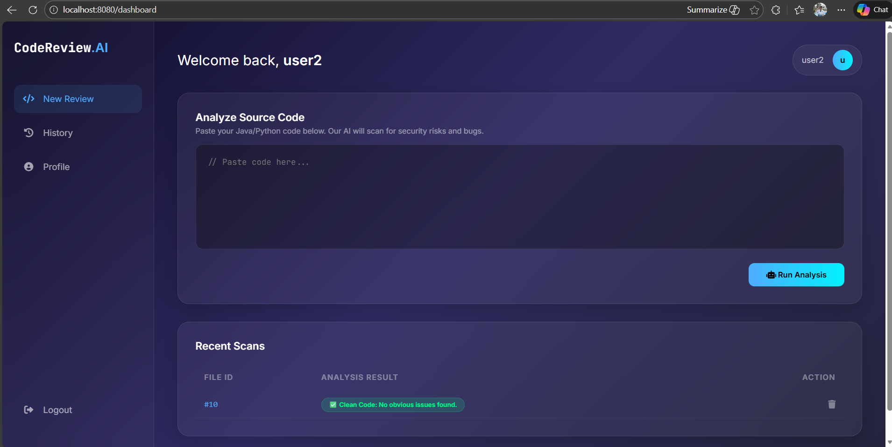
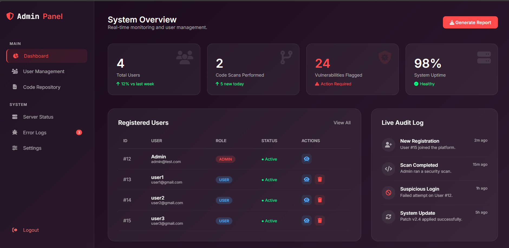
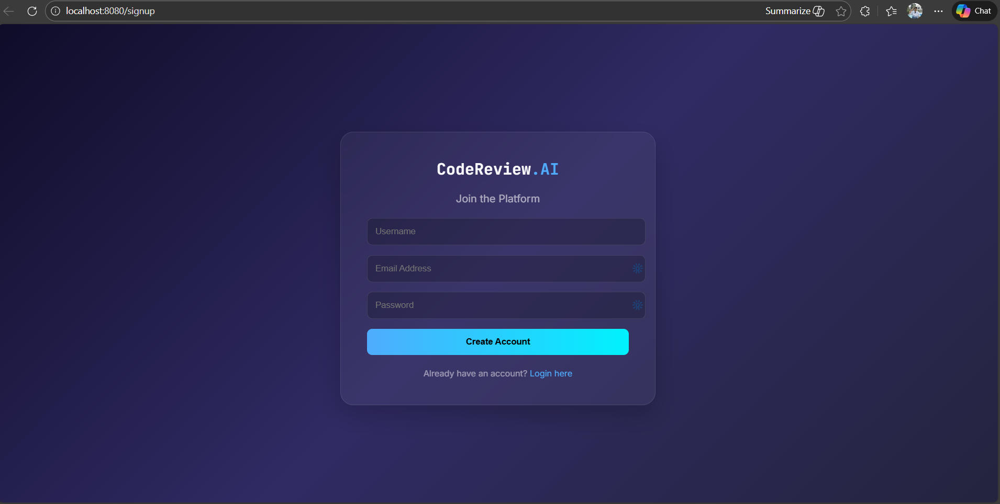
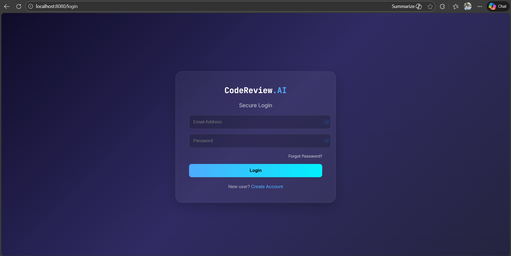

# 🚀 CodeReview.AI - ML-Powered Code Review Platform

> An enterprise-grade, microservice-based web application that utilizes Natural Language Processing (NLP) to analyze source code, detect security vulnerabilities, and provide actionable, best-practice solutions in real-time.


## 📖 Overview
Developed as a Master of Computer Applications (MCA) project at MIT World Peace University (MIT-WPU), this platform allows developers to submit source code for automated, intelligent review. 

Moving beyond standard static rule-based checks, this project features a dedicated **Python AI Microservice** powered by a Hugging Face Zero-Shot Classification model. It acts as an AI pair-programmer to detect complex security flaws that traditional linters miss.

It actively flags and explains:
- 🚫 **Security Risks:** Hardcoded credentials, SQL injection vulnerabilities, and weak cryptography.
- 💡 **Actionable Remediation:** Maps AI findings to industry-standard actionable fixes.
- 🧹 **Clean Code:** Identifies anti-patterns, resource leaks, and inefficient logging mechanisms.

## ✨ Core Features

### 🤖 AI Engine & Microservices
- **Hugging Face NLP:** Utilizes the `facebook/bart-large-mnli` model to contextually categorize code vulnerabilities.
- **RESTful Bridge:** Seamless, asynchronous communication between the Spring Boot backend and the isolated Python Flask AI engine, complete with graceful fallback error handling.

### 🔐 Security & Authentication
- **Google SSO (OAuth 2.0):** Secure, frictionless Single Sign-On using Google Identity Services.
- **BCrypt Hashing:** Secure credential storage for traditional email/password logins.
- **Role-Based Access Control (RBAC):** Strict session middleware protecting Admin routes from unauthorized access.

### 💻 User & Admin Dashboards
- **IDE-Like Experience:** Real-time, native syntax highlighting using `Highlight.js` (Dark Mode enabled).
- **Automated Reporting:** One-click generation of beautifully formatted PDF security audit reports using OpenPDF/iText.
- **Premium UI/UX:** A modern, highly responsive interface utilizing CSS Glassmorphism effects.
- **Admin Analytics:** Global system stats, user management, and deep-dive capabilities into historical code submissions.

## 🏗️ Technical Architecture
- **Core Backend:** Java 23, Spring Boot 3 (Web, Data JPA)
- **AI Microservice:** Python 3.12, Flask, PyTorch, Hugging Face Transformers
- **Frontend:** HTML5, CSS3, JavaScript (ES6), Thymeleaf Templates
- **Database:** MySQL
- **Integrations:** Google API Client, OpenPDF

## 📸 Interface Previews
| User Dashboard | Admin Panel |
| :---: | :---: |
|  |  | 
|  |  |

*(Note: Ensure screenshots are placed in a `/screenshots` folder at the root of the repository to display properly).*

## 🚀 Local Environment Setup

### 1. Database Configuration
Create a new MySQL database named `code_review_db`. The Spring Boot Data JPA module will automatically generate the required relational tables on startup.

### 2. Booting the AI Microservice (Python)
Navigate to the `AI_Engine` directory, initialize your virtual environment, install dependencies, and start the Flask server:
```bash
cd AI_Engine
python -m venv .venv
.\.venv\Scripts\activate  # On Windows
pip install -r requirements.txt
python app.py
